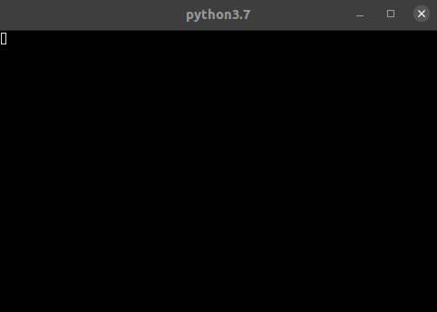

#  Running CARLA-SUMO-MOSAIC Co-Simulation Tool with NS-3 Integration in Docker

This is the tutorial to run CARLA-SUMO-MOSAIC co-simulation tool in a docker container. It is recommended to run the co-simulation tool on a **high-performance** computer.

## Test Platform

- Operating System: Ubuntu 20.04.2 LTS
- CPU: Intel(R) Core(TM) i7-9700K CPU @ 3.60 GHz
- RAM: 16 GB
- Graphics: NVIDIA GeForce RTX 2070 Super 8 GB

## Prerequisites

- NVIDIA GPU with at least 8 GB
- NVIDIA drivers > 361.93
- Free Disk Space > 30 GB
- NVIDIA Container Toolkit
- Docker

If you do not have Docker installed, please refer to this [link](https://usdot-carma.atlassian.net/wiki/spaces/CRMPLT/pages/486178841/Setup+CARMA+Platform+Prerequisites#Install-docker-using-docker-install.sh-in-CARMA-Platform-repo) for installation.

If you do not have NVIDIA Container Toolkit installed, please refer to this [link](https://usdot-carma.atlassian.net/wiki/spaces/CRMPLT/pages/486178841/Setup+CARMA+Platform+Prerequisites#CUDA-11.2-(Non-VM-installation)) for installation.

## Build/Pull Docker Image of Co-Simulation Tool

There are two ways to get co-simulation docker image. You can either choose to pull the co-simulation tool docker image from DockerHub or build the image by yourself.

#### Option 1, Pull Docker Image

To pull the co-simulation tool from DockerHub, make sure that you have been installed the docker tool into your system and have been login your personal account.

##### Step 1: Simply type the command to pull the docker image:

```sh
docker pull usdotfhwastol/carma-xil-cosimulation:[tag]
```

The tag information could be found from [usdotfhwastol Dockerhub](https://hub.docker.com/repository/docker/usdotfhwastol/carma-xil-cosimulation/tags?page=1&ordering=last_updated)

##### Step 2: Run docker image with a container:

```sh
cd <path-to-CARMA-simulation>/docker && ./run.sh
```

Once you access the conainer, skip the option 2 and go to the `Run carma-xil-cosimulation` step to test the co-simulation

#### Option 2, Build Docker Image
##### Prerequisites

To build the co-simulation tool docker image, the executable `carla_sumo_mosaic` file should be created firstly. The executable zip file located at the co-simulation folder as the name `carla-sumo-mosaic-[version].zip`. Extract the all contents into an empty folder with the name `carla_sumo_mosaic` then remember the directory of the folder for the later usage

##### Step 1: Build image from Dockerfile by using following command:

```sh
cd <path-to-CARMA-simulation>/docker && ./build-image.sh
```

##### Step 2: Run docker image with a docker container

```sh
cd <path-to-CARMA-simulation>/docker && ./run.sh
```

##### Step 3: Copy CARLA and Co-Simulation tool

Copy `CARLA_0.9.10`, executable `carla_sumo_mosaic` and `bridge` into the container.

```
docker cp <path-to-CARLA-simulation>/CARLA_0.9.10 <container-id>:./
docker cp <path-to-unzipped-carla-sumo-mosaic-folder>/carla_sumo_mosaic <container-id>:./
docker cp <path-to-CARMA-simulation>/co-simulation/bridge <container-id>:./
```

##### Step 4: Unzip scenarios from sample_scenario.zip at co-simulation folder and copy to docker

```
docker cp <path-to-folder>/Town04_20 <container-id>:./carla_sumo_mosaic/scenarios
```

### Modify files in Docker Container

#### Step 1: Modify `ns3_installer.sh`

In Docker container, type:

```sh
cd carla_sumo_mosaic/bin/fed/ns3
```

Then modify `ns3_installer.sh` by:

```
vim ns3_installer.sh
```

(If you see a message `vim: command not found`, please use `sudo apt-get install vim` to install vim as text editor)

In the `build_ns3()` function, after `CXXFLAGS="-Wno-error" python3.6 ./build.py --disable-netanim`, add the following command

```
sudo cp -ar ns-3.28/build/ns3 /usr/include/
```

#### Step 2: Build NS-3

In directory `carla_sumo_mosaic/bin/fed/ns3`, type:

```
./ns3_installer.sh
```

Once all 1947 files are compiled and a successful message shows up, it means NS-3 is successful installed.

#### Step 3: Add NS-3 as environment variable

```
export NS3_HOME='/carla_sumo_mosaic/bin/fed/ns3'
```

Use `printenv` to check if NS-3 is successful added to environment variable.

#### Step 4: Modify `run.sh`

In directory `carla_sumo_mosaic/bin/fed/ns3`, type:

```
vim run.sh
```

Change line 11 to:

```
LD_LIBRARY_PATH=/carla_sumo_mosaic/bin/fed/ns3/ns-allinone-3.28/ns-3.28/build /carla_sumo_mosaic/bin/fed/ns3/ns-allinone-3.28/ns-3.28/build/scratch/mosaic_starter --port=$port --cmdPort=$cmdport --configFile=scratch/ns3_federate_config.xml
```

## Run Co-Simulation Tool

Once everything is ready, under directory `/carla_sumo_mosaic`, simply type:

```
./mosaic.sh -s Town04_20
```

The command will start CARLA, SUMO and x-terminal showing the CALRA-MOSAIC loading status



When the x-terminal showing the CARLA-MOSAIC status is connected, simply click the SUMO play button to start the program


***Note: Current CARMA XIL Version has a known issue with a port conflict between NS-3 and CARMA-CARLA integration see [#39](https://github.com/usdot-fhwa-stol/carma-simulation/issues/39). The recommended workaround is to run exclusively one or the other module.***

### Commit the container back to image
After the run if there is no issue, commit docker container to docker image
```
docker container commit <container-id> usdotfhwastol/carma-xil-cosimulation:[tag]
```
