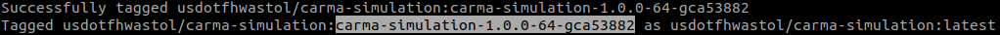
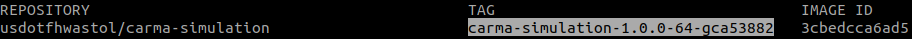

#  Running CARMA-simulation version 1.0.1

## Prerequisites

- NVIDIA GPU with at least 8 GB
- NVIDIA drivers > 361.93
- Free Disk Space > 30 GB
- NVIDIA Container Toolkit
- Docker
- CARLA Simulator 0.9.10

If you do not have Docker installed, please refer to this [link](https://usdot-carma.atlassian.net/wiki/spaces/CRMPLT/pages/486178841/Setup+CARMA+Platform+Prerequisites#Install-docker-using-docker-install.sh-in-CARMA-Platform-repo) for installation.

If you do not have NVIDIA Container Toolkit installed, please refer to this [link](https://usdot-carma.atlassian.net/wiki/spaces/CRMPLT/pages/486178841/Setup+CARMA+Platform+Prerequisites#CUDA-11.2-(Non-VM-installation)) for installation.

## Build/Pull Docker Image of Co-Simulation Tool

There are two ways to get co-simulation docker image. You can either choose to pull the co-simulation tool docker image from DockerHub or build the image by yourself.

#### Option 1, Pull Docker Image
##### Prerequisites

To pull the co-simulation tool from DockerHub, make sure that you have been installed the docker tool into your system and have been login your personal account.

##### Simply type the command to pull the docker image:

```sh
docker pull usdotfhwastol/carma-simulation:[docker-image-tag]
```

The docker tag information could be found from [usdotfhwastol Dockerhub](https://hub.docker.com/repository/docker/usdotfhwastol/carma-simulation/tags?page=1&ordering=last_updated).


#### Option 2, Build Docker Image
##### Prerequisites

Downalod [CARLA_0.9.10.tar.gz](https://carla-releases.s3.eu-west-3.amazonaws.com/Linux/CARLA_0.9.10.tar.gz) file then put the file under carma-simulation root folder

##### Build image from Dockerfile by using following command:

```sh
cd <path-to-CARMA-simulation>/docker && ./build-image.sh
```

## Run Docker Image

Once the build image process has been done, the terminal will show the docker image tag as picture below.



You also can check the docker image tag by the command **`docker images`**. The information will show as the picture below.



If you pull the docker image directly from DockerHub, simply copy the tag from [Tag page](https://hub.docker.com/repository/docker/usdotfhwastol/carma-simulation/tags?page=1&ordering=last_updated)

Copy tag string to do the following action for running Co-Simulation

#### Hello World MOSAIC Scenario for Testing
```sh
cd <path-to-CARMA-simulation>/docker && ./run.sh -v [docker-image-tag]
```

#### Run Scenario Existed on Docker
```sh
cd <path-to-CARMA-simulation>/docker && ./run.sh -v [docker-image-tag] -s --from_docker Town04_20
```

The sample Town04_20 scenario with CARLA and SUMO simulation will show up:


#### Run Sceanrio from Local
```sh
cd <path-to-CARMA-simulation>/docker && ./run.sh -v [docker-image-tag] -s --from_local [path-to-your-customize-sceanrio-folder]
```

## **Scenario Folder Content**

```
└─ <scenarioName>
 ├─ application
 | └─ <scenarioName>.db ................. Scenario database file
 ├─ carla
 | └─ carla_config.json ................. CARLA configuration file
 | └─ bridge.sh ......................... Bridge file
 ├─ mapping
 | └─ mapping_config.json ............... Mapping configuration file
 ├─ sumo
 | └─ <scenarioName>.net.xml ............ SUMO network file
 | └─ <scenarioName>.rou.xml ............ SUMO route file
 | └─ <scenarioName>.sumocfg ............ SUMO configuration file for SUMO
 | └─ sumo_config.json .................. SUMO configuration file for MOSAIC
 └─ scenario_config.json ................ Basic configuration of the simulation scenario

```

Here the scenario configuration file, the CARLA configuration file, and bridge file are introduced in detail below and take the **`Town04_20`** from **`sample_sceario.zip`** as an example. For other configuration files and scenario creation, refer to the documentation of Eclipse MOSAIC [[link](https://www.eclipse.org/mosaic/docs/scenarios/)]. Moreover, the CARLA 3D maps corresponding to the scenarios must be generated for co-simulation scenarios.

### **1.**   **Scenario configuration file**

The **scenario_config.json** is the main configuration file of a co-simulation scenario. A co-simulation scenario file looks like the following example.


```json
{
    "simulation": {
        "id": "Town04",
        "duration": "600s",
        "randomSeed": 212323853,
        "projection": {
            "centerCoordinates": {
                "latitude": 52.63,
                "longitude": 13.56
            },
            "cartesianOffset": {
                "x": 503.02,
                "y": 423.76
            }
        },
        "network": {
            "netMask": "255.255.0.0",
            "vehicleNet": "10.1.0.0",
            "rsuNet": "10.2.0.0",
            "tlNet": "10.3.0.0",
            "csNet": "10.4.0.0",
            "serverNet": "10.5.0.0",
            "tmcNet": "10.6.0.0"
        }
    },
    "federates": {
        "application": true,
        "cell": false,
        "environment": false,
        "sns": false,
        "ns3": false,
        "omnetpp": false,
        "output": false,
        "sumo": true,
        "carla": true
    }
}

```

The federate tags show which simulators are  used in the simulation. For the co-simulation scenarios, CARLA and SUMO federate must be enabled. If the CARLA federate is disabled, the simulation of SUMO and MOSAIC will be run.

### **2.**   **Carla configuration file**

The CARLA ambassador can be configured with the carla configuration file. The specific path is **<scenarioName>/carla/carla_config.json**.  The example configuration files of CARLA ambassador on Linux systems and on Windows systems are shown in the following, respectively.

```json
{
  "updateInterval": 100,
  "carlaUE4Path": "/opt/carla/",
  "bridgePath": "./scenarios/Town04_20/carla; bridge.sh",
  "carlaConnectionPort": 8913
}
```

The following table descripts the parameters in the CARLA configuration file.

| Parameters          | **Type** | **Description**                                              | **Required** |
| ------------------- | -------- | ------------------------------------------------------------ | ------------ |
| updateInterval      | int   | The Interval after which the CARLA is updated.  The default unit is ms. Define the size  of one simulation step in CARLA. The updateInterval of Carla and Sumo  ambassador must be the same.  **Note**: the minimal value of updateInterval is 100ms and the default setting of updateInterval being predefined in the java code is 1000ms for both carla and sumo configuration. | Yes          |
| carlaUE4Path        | string   | Path to CarlaUE4 executable file. | Yes           |
| bridgePath          | string   | This parameter includes two information separated by the  semicolon. The first substring is the path of bridge .sh or .bat. The second  substring is the file name of bridge .sh. The extension of the bridge file is needed. | Yes          |
| carlaConnectionPort | int   | The bridge server port . It must be the same as  the bridge server port number in the bridge .sh file.  If the entry is not used, the default port number is 8913. | No           |

### **3.**  **Bridge file**

The bridge file bridge.sh is used to run the bridge to connect CARLA simulator and CARLA ambassador, load maps to CARLA simulator, pass messages between CARLA ambassador and CARLA simulator. The examples of bridge files on Linux systems is shown in the following, respectively.

```.sh
#!/bin/bash

#x-terminal-emulator
cd ../../../bridge

x-terminal-emulator -e python3.7 carla_mosaic_bridge.py --bridge-server-port 8913 -m Town04 ../scenarios/Town04_20/sumo/Town04.net.xml --step-length 0.1 --tls-manager sumo
```

The arguments in the above python commands are shown in the following.

**`--bridge-server-port 8913`:** The port number that the bridge server is listening to. It must be the same as the carlaConnectionPort in the carla configuration file. If not specified, the default port number 8913 will be used for the bridge server.

**`--m Tow04`**: the map loaded in the CARLA simulator. If not specified, the default map of CARLA simulator will be used.

**`../scenarios/Town04_20/sumo/Town04.net.xml`**: the net file of the CARLA map or SUMO, the net file is located in the.

**`--step-length`**: the simulation step length, which should be the same as the updateInterval of CARLA.

**`--tls-manager`**: the traffic light manager. Since co-simulation currently supports CARLA and SUMO simulation, parsing parameter to indicate which simulations to control traffic light to avoid the conflict

### 4. Mapping Configuration File

The Mapping ambassador can be configured with the mapping configuration file. The specific path is **<scenarioName>/mapping/mapping_config.json**. Please refer to this [link](https://www.eclipse.org/mosaic/docs/simulators/application_mapping/) for more information about the configuration file.

## **Check the Log Files**

Log files are generated for the used ambassadors for each simulation run. They are stored in the folder `<cosimulation-root>/logs/log-<timestamp>-scenarioname`. Each simulation run has a  new log file folder generated. The folder structure of log file folder looks like the following. The log file Carla.log is about CARLA ambassador.
