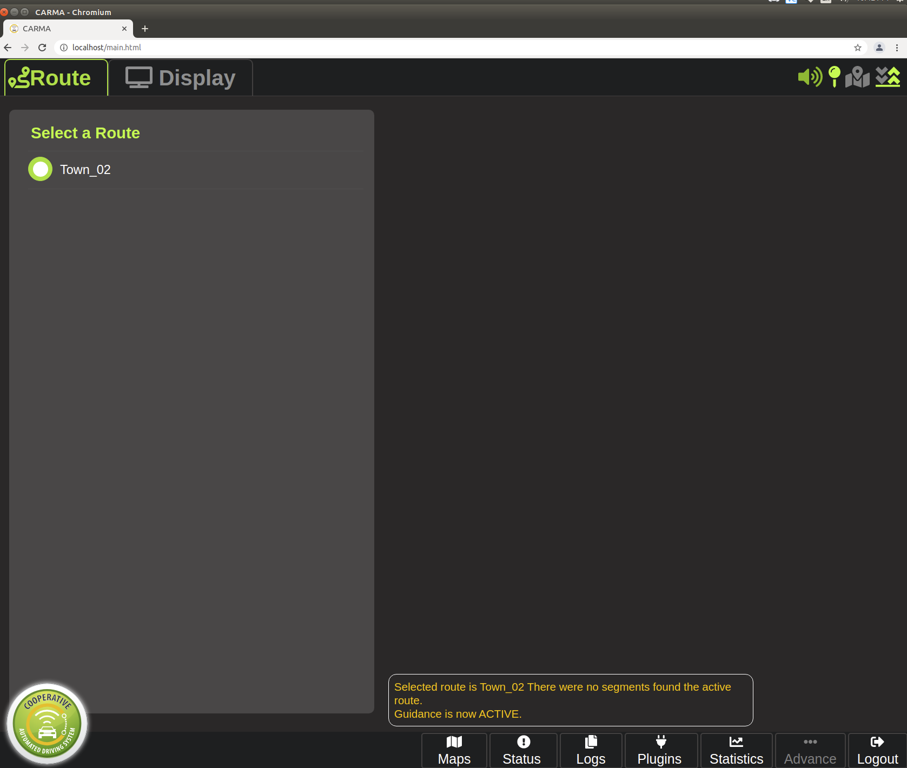

# CARAL-CARMA Integration Tool
This user guide provides step-by-step user instructions on how to build the CARLA-CARMA integration tool on Docker, setup configuration for both CARMA platform and CARLA-CARMA integration tool and run that with CARMA platform.

##  Requirement
-  Docker (19.03+)
-  [Nvidia Docker](https://github.com/NVIDIA/nvidia-docker)
-  [CARMA Platform](https://usdot-carma.atlassian.net/wiki/spaces/CRMPLT/pages/486178827/Development+Environment+Setup) (3.8.0+)

## Setup
### CARLA-CARMA Integration tool
1. clone the CARMA simulation repository:

```
git clone https://github.com/usdot-fhwa-stol/carma-simulation.git
```
2. build image from Dockerfile by using following command:

```sh
cd carma-simulation/carla-carma-integration && ./build.sh
```
After built the image successfully, the CARLA-CARMA integration tool docker image will be generated.

### CARMA Platform config
The CARMA Config for the simulation currently cannot be pulled from docker hub. It requires local docker build for the image.

1. Clone the source code of CARMA config from github:
```sh
git clone https://github.com/usdot-fhwa-stol/carma-config.git
```
2. Go to the directory /carla_integration under CARMA config and build the docker image. Remember the image name
```sh
cd ~/carma-config/carla_integration/
./build-image.sh
```
3. SetupCARMA config of the simulation
```sh
carma config set usdotfhwastol/carma-config:[tag]
```
## Run CARLA-CARMA integration tool with CARMA Platform
1. Run CARLA server

```
./CarlaUE4.sh
```
2. Run CARMA Platform with separated terminal
```
carma start all
```

3. Run CARLA-CAMRA integration tool docker image by using run.sh file in the direction **`carma-simulation/carla-carma-integration`** and launch the tool when get into container
```
./run.sh
```
```
roslaunch carla_carma_agent carla_carma_agent.launch
```
Once CARLA-CARMA integration tool has been launched, the CARMA corresponding CARLA vehicle will be generated in CARLA server.

4. Open CARMA-Web-UI for selecting route and plugins via Chromium Web Browser then click the circle button at the left bottom corner.

**`Guidance is now ACTIVE`** message will be shown after clicked circle button as the picture below



5. Publish robot_status ROS message to CARMA platform
```sh
rostopic pub /hardware_interface/controller/robot_status cav_msgs/RobotEnabled "{robot_active: true, robot_enabled: true, torque: 0.0, torque_validity: false, brake_decel: 0.0, brake_decel_validity: false, throttle_effort: 0.0, throttle_effort_validity: false, braking_effort: 0.0, braking_effort_validity: false}" --rate=1000
```
Afterward, the corresponding CARLA vehicle will start to receive control command from CARMA-Platform and start to following the selected route to move

## Usage instruction
The usage instruction including what parameter could be parsed to CALRA-CARMA integration tool launch file and the description of these parameters

### CARLA-CARMA Integration parameters
| Parameters| **Description**|*Default*|
| ------------------- | ------------------------------------------------------------ |----------|
|host|CARLA server IP address|127.0.0.1|
|port|CARLA server port number|2000|
|town|To specify which scenario for CARLA server to load. The scenario should be matched with executed CARMA Platform vector_map|Town02|
|spawn_point|To specify where to spawn CARLA vehicle|N/A|
|role_name|Assign the name of the CARLA vehicle. It currently only supports the name range from hero0 to hero9 and ego_vehicle|ego_vehicle|
|vehicle_modle|To specify what vehicle model should be generated in CARLA server|vehicle.toyota.prius|
|vehicle_length|To specify the length of vehicle|5.00|
|vehicle_width|To specify the width of vehicle|3.00|
|vehicle_wheelbase|To specify the size of wheelbase for the vehicle|2.79|
|speed_Kp| Speed proportional value for the vehicle. The current default value was setup for Town02 with vehicle speed limit 20 MPH|0.05|
|speed_Ki| Speed integral value for the vehicle. The current default value was setup for Town02 with vehicle speed limit 20 MPH|0.018|
|speed_Kp| Speed derivative value for the vehicle. The current default value was setup for Town02 with vehicle speed limit 20 MPH|0.4|
|accel_Kp| Acceleration proportional value for the vehicle. The current default value was setup for Town02 with vehicle speed limit 20 MPH|0.053|
|accel_Ki| Acceleration integral value for the vehicle. The current default value was setup for Town02 with vehicle speed limit 20 MPH|0.0|
|accel_Kd| Acceleration derivative value for the vehicle. The current default value was setup for Town02 with vehicle speed limit 20 MPH|0.052|
|init_speed| To specify the initial vehicle speed |5|
|init_acceleration| To specify the initial vehicle acceleration |1|
|init_steering_angle| To specify the initial vehicle steering wheel angle, it range from 0.7(left) to -0.7(right)|0|
|init_jerk| To specify the initial vehicle jerk value|0|
